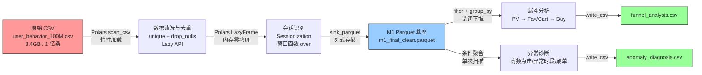

# M1 电商数据管道项目

> 亿级电商日志 ETL 流水线 —— 基于 Polars Lazy API 的高性能数据处理方案

---

## 📋 项目概况

### 任务背景

本项目旨在处理 **1 亿条电商用户行为日志**，完成从原始 CSV 到分析就绪型 Parquet 格式的工程化转型。面对 3.4GB 的海量数据，传统 Pandas 方案易出现 OOM（内存溢出）问题，因此采用 **Polars Lazy API** 实现惰性计算，确保在有限内存下高效完成全量数据处理。

### 数据集信息

| 属性 | 描述 |
|------|------|
| **源文件** | `user_behavior_100M.csv` |
| **文件大小** | 3.4 GB |
| **记录数** | 100,150,807 条 |
| **核心字段** | `user_id`, `item_id`, `behavior_type`, `timestamp` |
| **行为类型** | `pv` (浏览), `fav` (收藏), `cart` (加购), `buy` (购买) |
| **时间跨度** | 2017-11-25 ~ 2017-12-03（9 天） |

---

## 🔄 数据流转图



### 阶段说明

| 阶段 | 工具/技术 | 核心操作 |
|------|-----------|----------|
| **数据提取** | Polars `scan_csv` / `scan_parquet` | 惰性加载，不占用内存 |
| **清洗去重** | Polars Lazy `unique` | 四维度去重 (user_id, item_id, behavior_type, timestamp) |
| **会话识别** | Polars 窗口函数 `over` | 相邻行为间隔 > 30 分钟 视为新会话 |
| **漏斗分析** | 谓词下推 + 条件聚合 | 单次扫描计算 PV/Fav-Cart/Buy 转化率 |
| **异常诊断** | 条件标记 + 聚合 | 高频点击、异常时段、刷单嫌疑检测 |
| **数据输出** | `sink_parquet` / `write_csv` | 列式存储 + CSV 报告 |

---

## 🛠️ 核心技术栈

| 技术 | 版本 | 价值 |
|------|------|------|
| **Polars** | ≥ 0.19.0 | 基于 Rust 的高性能 DataFrame 引擎，Lazy API 实现惰性计算，解决 OOM 问题 |
| **Parquet** | - | 列式存储格式，压缩比高，支持谓词下推，I/O 效率提升 5-10 倍 |
| **DuckDB** | ≥ 0.9.0 (可选) | 嵌入式 OLAP 数据库，支持 SQL 查询 Parquet，适合即席分析 |
| **Python** | ≥ 3.8 | 脚本语言，提供简洁的 ETL 流水线编排 |

### 为什么选择 Polars？

```python
# ❌ Pandas - 立即加载，占用大量内存
import pandas as pd
df = pd.read_csv("3.4GB_file.csv")  # 瞬间占用 10GB+ 内存

# ✅ Polars - 惰性加载，查询优化
import polars as pl
df = pl.scan_csv("3.4GB_file.csv")  # 不占用内存，仅记录查询计划
result = df.filter(...).group_by(...).collect()  # collect() 时才执行
```

---

## 📊 核心业务指标

### 数据处理结果

| 指标 | 数值 | 说明 |
|------|------|------|
| **最终数据总量** | 100,115,355 条 | 去重后有效记录 |
| **去重率** | 0.04% | 删除重复记录 35,452 条 |
| **总会话数** | 16,571,196 个 | 基于 30 分钟超时阈值 |
| **平均每会话行为数** | 6.0 条 | 用户单次会话平均交互深度 |
| **异常账号识别比例** | 0.03% | 高频点击/异常时段/刷单嫌疑 |

### 转化漏斗

| 阶段 | 用户数 | 转化率 | 阶段转化率 |
|------|--------|--------|------------|
| **PV (浏览)** | 984,114 | 100.00% | - |
| **Fav/Cart (收藏/加购)** | 486,794 | 49.47% | 49.47% |
| **Buy (购买)** | 77,690 | 7.89% | 15.96% |

---

## 🚀 快速开始

### 环境依赖

```bash
# 1. 创建虚拟环境
python -m venv data_env

# 2. 激活虚拟环境
# Windows
data_env\Scripts\activate
# macOS / Linux
source data_env/bin/activate

# 3. 安装依赖
pip install polars duckdb pyarrow
```

### 运行流水线

```bash
# 方式一：一键执行完整流水线
python run_m1_pipeline.py

# 方式二：分步执行（调试用）
python -c "
from m1_data_pipeline_optimized import M1DataPipeline
pipeline = M1DataPipeline('m1_final_clean.parquet')
df = pipeline.extract()
result = pipeline.transform(df)
saved = pipeline.load(result, output_dir='output')
print(saved)
"

# 方式三：查看查询执行计划
python -c "
from m1_data_pipeline_optimized import M1DataPipeline
pipeline = M1DataPipeline('m1_final_clean.parquet')
df = pipeline.extract()
pipeline.explain_plan(df)
"
```

### 输出文件

执行完成后，`output/` 目录将生成以下文件：

| 文件 | 格式 | 说明 |
|------|------|------|
| `deduped_data.parquet` | Parquet | 去重后的清洁数据 |
| `sessionized_data.parquet` | Parquet | 带会话标识的数据 |
| `funnel_analysis.csv` | CSV | 转化漏斗分析报告 |
| `anomaly_diagnosis.csv` | CSV | 异常流量诊断报告 |
| `pipeline_summary.txt` | TXT | 综合运行报告 |

---

## 📁 项目结构

```
04exp/
├── m1_data_pipeline.py          # 主流水线类（原始版本）
├── m1_data_pipeline_optimized.py # 优化版本（推荐）
├── run_m1_pipeline.py           # 程序入口脚本
├── benchmark.py                 # 性能基准测试
├── README.md                    # 项目文档
├── output/                      # 输出目录（运行后生成）
    ├── deduped_data.parquet
    ├── sessionized_data.parquet
    ├── funnel_analysis.csv
    ├── anomaly_diagnosis.csv
    └── pipeline_summary.txt

```

### 关键文件说明

| 文件 | 职责 |
|------|------|
| `m1_data_pipeline.py` | 核心流水线类 `M1DataPipeline`，包含 extract/transform/load 三阶段 |
| `m1_data_pipeline_optimized.py` | 优化版本，消除冗余 collect，利用谓词下推 |
| `run_m1_pipeline.py` | 程序入口，负责初始化并运行流水线 |
| `benchmark.py` | 性能测试脚本，对比不同方案耗时与内存占用 |

---

## 🔧 配置说明

### 会话超时阈值

在 `M1DataPipeline` 类中修改：

```python
self.session_timeout = 1800  # 单位：秒（默认 30 分钟）
```

### 异常检测阈值

```python
# 高频点击阈值
click_threshold = 100  # 单用户点击超过 100 次

# 异常时间段
abnormal_hours = [2, 3, 4, 5]  # 凌晨 2-5 点

# 刷单嫌疑阈值
buy_threshold = 5  # 单用户购买超过 5 次
```

---

## 📈 性能优化建议

### 1. 启用谓词下推

在 `extract()` 方法中添加 `predicate` 参数：

```python
df = pl.scan_parquet(
    self.data_path,
    predicate=pl.col("user_id").is_not_null()
)
```

### 2. 调整并行度

```python
pl.Config.set_streaming_chunk_size(10000)  # 调整流式处理块大小
```

### 3. 使用 `explain()` 验证查询计划

```python
pipeline.explain_plan(df_dedup)
# 确认是否触发 Predicate Pushdown、Projection Pushdown
```

---

## 🐛 常见问题

### Q: 内存不足怎么办？

A: 确保使用 `scan_parquet` 而非 `read_parquet`，避免中间 `collect()`。

### Q: 如何处理更大的数据集（10 亿+）？

A: 考虑分片处理或使用 DuckDB 进行外部排序：

```python
import duckdb
duckdb.query("""
    SELECT * FROM 'data.parquet' 
    ORDER BY user_id, timestamp 
    LIMIT 1000000
""")
```

### Q: 转化率为 0 怎么办？

A: 检查 `behavior_type` 字段值是否与预期一致（pv/fav/cart/buy）。


---

<div align="center">

**如有问题，请提 Issue 或联系维护者**

</div>
