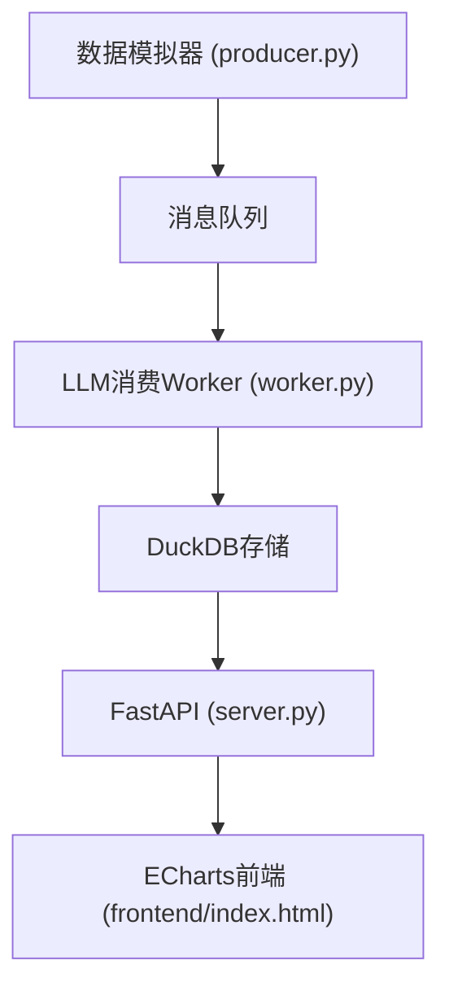

# 大数据分析课程实验系统

## 项目简介与特色
本项目是一个大数据分析课程实验系统，旨在通过实际操作帮助学生理解大数据处理和可视化技术。项目基于Python FastAPI、DuckDB、Polars、ECharts以及LLM大模型API构建。

### 核心技术亮点
1. **FastAPI**：高性能的Web框架，用于快速构建后端API。
2. **DuckDB**：轻量级、高效的嵌入式SQL数据库，支持大规模数据处理。
3. **Polars**：高性能的数据处理库，适用于大规模数据集的高效计算。
4. **ECharts**：强大的图表库，用于数据可视化。
5. **LLM大模型API**：集成大语言模型API，用于特征处理和数据分析。

## 系统架构与数据流拓扑
## 系统架构与数据流拓扑
以下是系统的整体架构和数据流拓扑图：


- **数据模拟器 (producer.py)**：生成模拟数据并发送到消息队列。
- **消息队列**：暂存数据，等待LLM消费Worker处理。
- **LLM消费Worker (worker.py)**：从消息队列中读取数据，使用LLM API进行特征处理，并将结果存储到DuckDB。
- **DuckDB存储**：存储处理后的数据，供FastAPI查询。
- **FastAPI (server.py)**：提供RESTful API接口，从前端接收请求并返回数据。
- **ECharts前端 (frontend/index.html)**：展示数据可视化看板。

## 快速开始与部署指南
### 虚拟环境创建
#### Windows
```bash
python -m venv venv
venv\Scripts\activate
```

#### Mac/Linux
```bash
python3 -m venv venv
source venv/bin/activate
```

### 依赖安装
确保已经激活虚拟环境，然后运行以下命令安装依赖：
```bash
pip install -r requirements.txt
```

### 一键启动
#### Windows
```bash
python run_app.py
```

#### Mac/Linux
```bash
python3 run_app.py
```

## 配置说明
### LLM API密钥配置
在项目根目录下创建一个`.env`文件，并添加以下内容：
```env
LLM_API_KEY=your_llm_api_key
```
请将`your_llm_api_key`替换为您的实际LLM API密钥。

### 修改8000端口
如果需要修改默认的8000端口，可以在`run_app.py`文件中修改`PORT`常量的值：
```python
PORT = 8000  # 将8000修改为您需要的端口号
```

## 项目目录树说明
```
C:\Users\86155\.npm-global\data_practice\12exp
├── dashboard
│   ├── frontend
│   │   └── index.html  # 前端看板页面
│   ├── producer.py     # 数据流模拟器
│   ├── run_app.py      # 一键启动脚本
│   ├── server.py       # 后端接口
│   └── worker.py       # LLM特征处理
├── .env                # LLM API密钥配置文件
├── README.md           # 项目文档
└── requirements.txt    # 项目依赖
```

- **.env**：包含LLM API密钥的配置文件。
- **README.md**：项目文档。
- **requirements.txt**：项目依赖列表。
- **dashboard/frontend/index.html**：前端看板页面。
- **dashboard/producer.py**：数据流模拟器。
- **dashboard/run_app.py**：一键启动脚本。
- **dashboard/server.py**：后端接口。
- **dashboard/worker.py**：LLM特征处理。